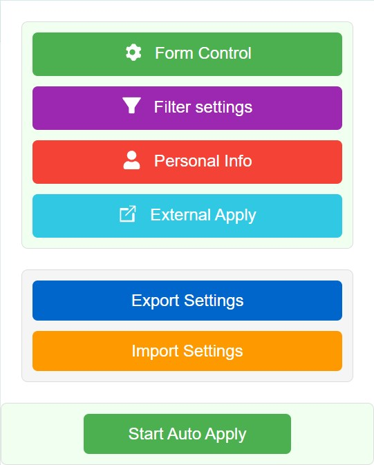
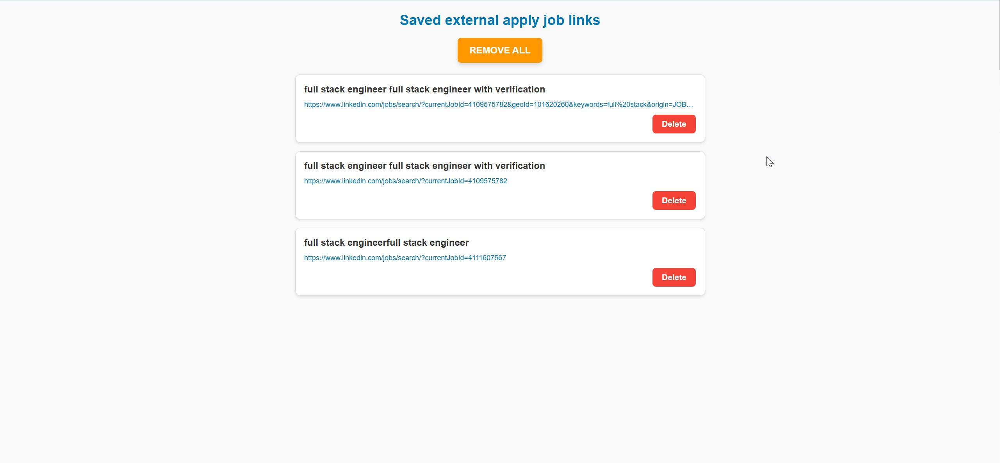
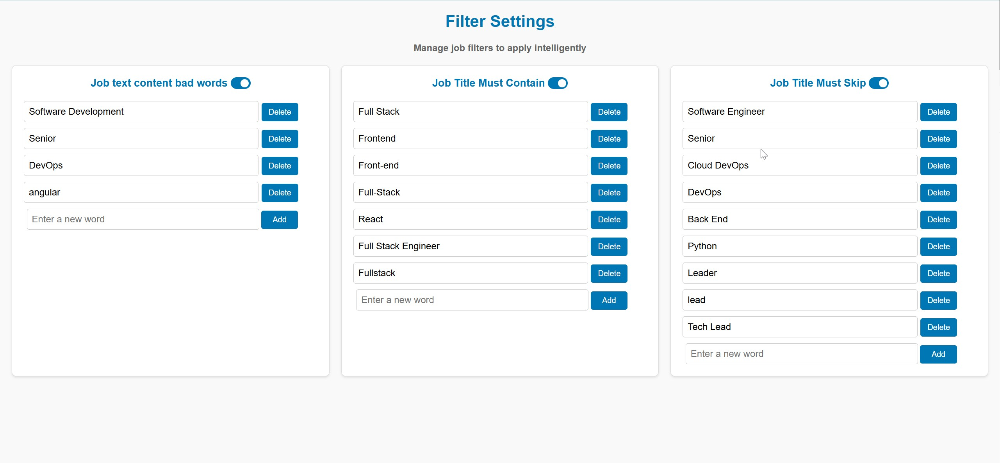
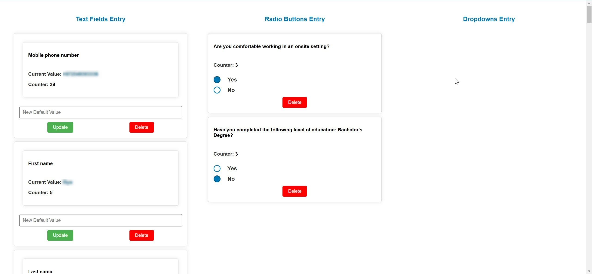
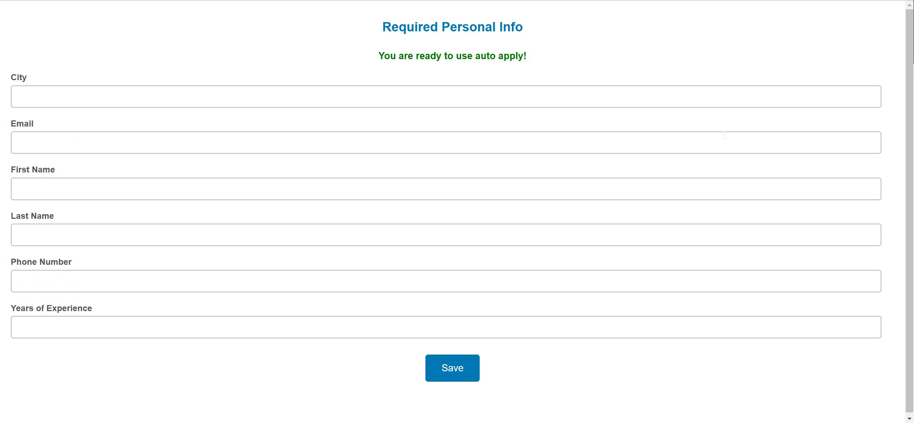
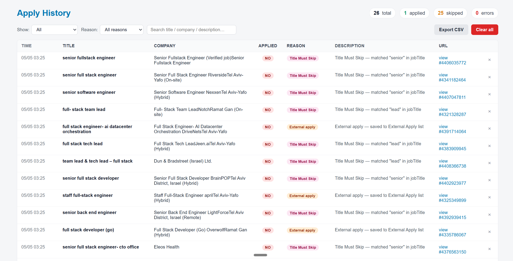
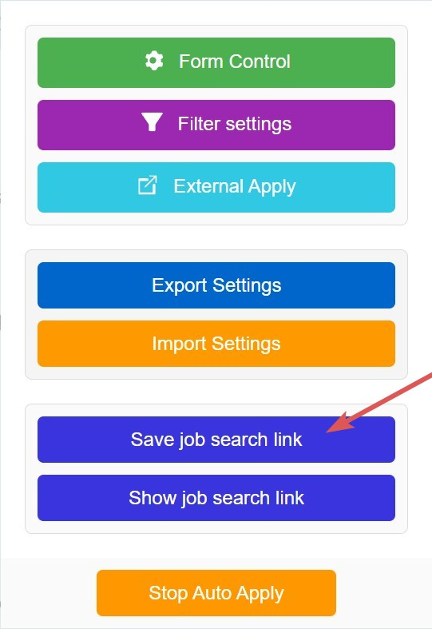
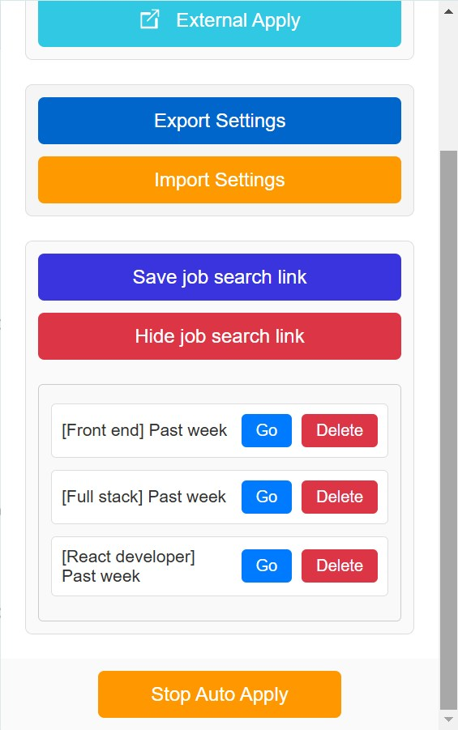

**The project has moved to a new tech stack: Vite + WXP ** [Chrome-linkedin-applier](https://github.com/IliyaBrook/Chrome-linkedin-applier)

# Easy Apply LinkedIn

Chrome extension that automates LinkedIn's **Easy Apply** flow, filters jobs
by your rules, and keeps a full record of every application it touches.

[](https://chromewebstore.google.com/detail/easyapplylinkedin/gncaadiobcdbnfnapjcjnpnibkgebfnk)

---

## What's new

LinkedIn rolled out a new Jobs UI on `/jobs/search-results/` with a
shadow-DOM apply modal. The extension was rewritten end-to-end to handle
both the legacy and the new UI side-by-side and to give you full visibility
into every job it processed.

- **Dual-UI support** — works on both `/jobs/search/` (legacy) and
  `/jobs/search-results/` (new SDUI flow). Selectors use stable
  `aria-label`, `data-component-type`, and `componentkey` attributes
  instead of LinkedIn's hashed CSS classes.
- **Easy Apply detection rewritten** — LinkedIn dropped the literal
  *"Easy Apply"* text from the apply control. The new detection uses three
  fallback signals (`aria-label^="LinkedIn Apply to"`,
  `?openSDUIApplyFlow=true`, and `.jobs-apply-button`).
- **Shadow-DOM apply flow** — the SDUI modal renders inside a shadow root.
  Form-filling, radio/dropdown/checkbox handling and multi-step Next-flow
  all reach into the shadow tree correctly.
- **Real submission verification** — `applied: YES` is recorded only when
  Submit was actually clicked **and** the *"Your application was sent to …"*
  modal was observed. Otherwise the entry is recorded as `submitNotConfirmed`
  or `noSubmitButton` so false positives are gone.
- **Smarter Already-Applied detection** — handles the new UI's
  `<p>Applied</p>` badge with lazy-render delays and re-fetches the live
  card by job id before deciding.
- **Better debug logging** — `[AutoApply]` logs preserve their original
  call-site in DevTools (clickable file:line). Boundary log lines explain
  exactly why iteration stopped.
- **New Apply History page** — a table view of every job the bot evaluated
  with filtering, search, CSV export and one-click *Clear all*. See
  [Apply History](#6-apply-history) below.

---

## Features

### 1. Popup Menu

Main entry point in the Chrome toolbar. Quick access to every page and
settings, plus the **Start Auto Apply** button.



### 2. External Apply Links

Jobs that aren't Easy Apply are saved here so you can apply manually later.
Duplicates are deduplicated by URL and by `title + company`.



### 3. Filter Settings

- **Job Title Must Contain** — only apply to jobs whose title contains one
  of these words.
- **Job Title Must Skip** — never apply to jobs whose title contains one of
  these words. Takes priority over *Must Contain*.
- **About the job — bad words** — skip jobs whose description contains any
  of these words.



### 4. Form Control

Every question the bot has ever encountered is collected here. Fill in
your preferred answers once and the bot will reuse them for all future
applications.



### 5. Personal Information

Stores name, email, phone and location. These are used to fill in the
Easy Apply contact-info step.



### 6. Apply History

A dedicated page with a complete log of every job the bot evaluated.



| Column | Meaning |
|---|---|
| Time | When the entry was recorded |
| Title | Job title |
| Company | Company name |
| Applied | YES / NO badge |
| Reason | Why the job was skipped (`titleSkip`, `titleFilterMissing`, `badWord`, `external`, `alreadyApplied`, `submitNotConfirmed`, `noSubmitButton`, `noEasyApply`, `clickFailed`, `detailsNotLoaded`, `error`, …) |
| Description | Specifics — e.g. *"Matched bad word in description: 'java'"* or *"Title Must Skip — matched 'senior' in jobTitle"* |
| URL | Direct link to the job |
| × | Per-row delete |

The page also offers:

- Filters by **status** (All / Applied / Not applied / Errors only) and by
  **reason**
- Free-text search across title, company and description
- **Clear all** (with confirmation) wipes the entire history
- **Export CSV** for the currently filtered rows
- Live refresh via `chrome.storage.onChanged` — entries appear as the
  script processes new jobs

Errors are first-class: any unhandled exception inside the iteration is
recorded as an `error` row whose Description contains the actual exception
message, so problems show up in the UI instead of being buried in the
console.

### 7. Saved Job Search Links

Save your favourite LinkedIn search URLs (with all filters applied) and
launch the bot against any of them in one click — even from outside
LinkedIn.

1. Go to LinkedIn Jobs and run a search with your usual filters.
2. In the popup click **Save job search link** and give it a name.
   
3. Anywhere later, open the popup → **Show job search links** → **Go**
   next to the search you want to run.
   

The extension navigates to the saved URL and starts auto-applying.

---

## Install

**From the Chrome Web Store** (recommended):

[Easy Apply LinkedIn on the Chrome Web Store](https://chromewebstore.google.com/detail/easyapplylinkedin/gncaadiobcdbnfnapjcjnpnibkgebfnk)

**From source** (developer mode):

```bash
git clone https://github.com/IliyaBrook/autoApplylinkedin.git
```

1. Open `chrome://extensions`.
2. Enable **Developer mode** (top-right).
3. Click **Load unpacked** and pick the cloned folder.

---

## Usage

1. Open the popup from the Chrome toolbar.
2. Fill in **Personal Information** and your **Filter Settings**.
3. Navigate to a LinkedIn jobs search (either `/jobs/search/` or
   `/jobs/search-results/` works) and click **Start Auto Apply**.
4. Watch progress live in **Apply History** — every skip and submission is
   logged with its reason.
5. Use **External Apply Links** for jobs that need manual submission and
   **Form Control** to teach the bot answers to new questions it
   encounters.

---

## Debugging

Every log line written by the extension is prefixed with `[AutoApply]` and
keeps its real call-site, so DevTools shows the actual file and line you
can click straight to. Boundary logs around the iteration loop and
pagination explain exactly why the script stopped (limit reached, last
page, paused, error, …).

To hide bot logs in DevTools Console, type `-AutoApply` in the filter box.

---

## Feedback

Bugs and feature requests:
[github.com/IliyaBrook/autoApplylinkedin/issues](https://github.com/IliyaBrook/autoApplylinkedin/issues)
